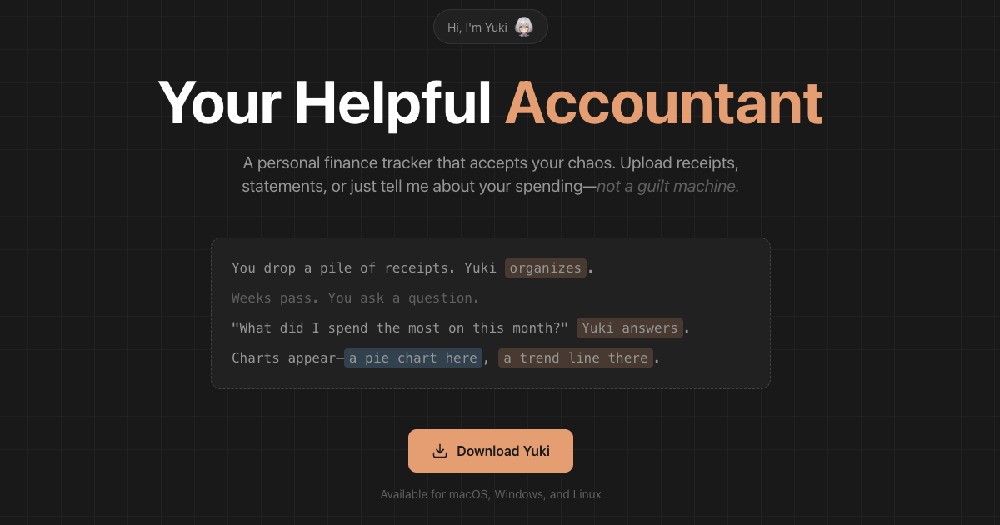

# Yuki

**Your Helpful Accountant**

Yuki is a local-first personal finance tracker that accepts your financial chaos and makes sense of it. Built as part of a suite of projects to build utility for local LLM models and specialized simple AI apps.

Unlike traditional budgeting apps that demand bank connections and rigid categorization, Yuki lets you drop in financial documents in any format—bank statements, receipts, CSVs, screenshots—and uses AI to organize everything locally on your machine.

## Features

- **Multi-format document support** - PDFs, CSVs, images, screenshots, plain text
- **Smart document parsing** - LLM-powered extraction of transactions from any document format
- **Natural language queries** - Ask questions like "What did I spend on food this month?"
- **Local-first privacy** - All data stays on your machine, no cloud sync required
- **Flexible LLM providers** - Works with local models (Ollama, LMStudio) or cloud APIs (Anthropic, OpenAI, Google, OpenRouter)
- **Visual analytics** - Pie charts, bar charts, line charts, and tables
- **Multi-account tracking** - Checking, savings, credit, cash, investment, mobile money
- **Receipt scanning** - Extract individual items from receipt photos

## Installation

### Download Pre-built Release

Download the latest release for your platform from the [Releases page](https://github.com/porkytheblack/yuki/releases).

### Build from Source

**Prerequisites:**
- Node.js 18+
- Rust (latest stable)
- Tauri CLI

```bash
# Clone the repository
git clone https://github.com/porkytheblack/yuki.git
cd yuki/app

# Install dependencies
npm install

# Run in development mode
npm run tauri:dev

# Build for production
npm run tauri:build
```

## Getting Started

### 1. Initial Setup

When you first launch Yuki, the Setup Wizard will guide you through configuring your LLM provider:

**Local LLM Options:**
- **Ollama** - Free, runs locally. [Install Ollama](https://ollama.ai)
- **LMStudio** - Free, runs locally. [Install LMStudio](https://lmstudio.ai)

**Cloud LLM Options:**
- **Anthropic** (Claude) - Requires API key
- **OpenAI** (GPT) - Requires API key
- **Google** (Gemini) - Requires API key
- **OpenRouter** - Requires API key

For best results with document parsing, use a model with vision capabilities (e.g., Claude 3, GPT-4V, Gemini Pro Vision).

### 2. Upload Documents

Drag and drop financial documents onto the Yuki interface:

- **Bank statements** (PDF) - Full transaction history
- **CSV exports** - From your bank or credit card
- **Receipt photos** - Individual purchase receipts
- **Screenshots** - Of transaction confirmations

After dropping a file, Yuki will ask whether it's a **Statement** (adds transactions to your ledger) or a **Receipt** (extracts items without ledger entry).

### 3. Ask Questions

Type natural language questions in the chat box:

- "What did I spend last month?"
- "Show me my grocery expenses"
- "How much did I spend on subscriptions this year?"
- "What's my average daily spending?"
- "Compare my spending between January and February"

Yuki translates your question to a database query and returns results as text, charts, or tables.

### 4. Navigate Results

- **← →** Navigate between multiple answer cards
- **↑ ↓** Browse your query history

### 5. View Your Ledger

Click the ledger icon (bottom of screen) to:

- Browse all transactions
- View spending charts
- See uploaded source documents
- Export data as CSV
- Delete entries

## How It Works

### Document Processing

1. You drop a document onto Yuki
2. The file is saved locally to `~/.yuki/documents/` or `~/.yuki/images/`
3. Yuki sends the document to your configured LLM for parsing
4. Transactions are extracted and stored in a local SQLite database
5. You see a confirmation with the number of transactions added

### Query Processing

1. You type a question in natural language
2. Yuki sends your question to the LLM with your database schema
3. The LLM generates a SQL query
4. Yuki executes the query against your local database
5. Results are formatted and displayed as text, charts, or tables

### Data Storage

All data is stored locally in `~/.yuki/`:

```
~/.yuki/
├── yuki.db          # SQLite database with all transactions
├── documents/       # Uploaded PDFs and CSVs
├── images/          # Receipt photos
└── config.json      # Settings (API keys are encrypted)
```

## Configuration

Access settings via the gear icon at the bottom of the screen.

### LLM Provider Settings

- **Provider** - Select your LLM provider
- **Endpoint** - API endpoint (auto-filled for cloud providers)
- **API Key** - Your API key (stored encrypted locally)
- **Model** - Specific model to use

### App Settings

- **Theme** - Light/Dark mode
- **Currency** - Default currency for transactions
- **Sound** - Enable/disable notification sounds

## Transaction Categories

Yuki organizes transactions into these categories:

| Category | Description |
|----------|-------------|
| Income | Salary, freelance, investments |
| Housing | Rent, mortgage, repairs |
| Utilities | Electric, water, internet, phone |
| Groceries | Food and household supplies |
| Dining | Restaurants, takeout, coffee shops |
| Transportation | Gas, public transit, rideshare, parking |
| Entertainment | Movies, games, streaming, events |
| Shopping | Clothing, electronics, general retail |
| Healthcare | Medical, dental, pharmacy, insurance |
| Subscriptions | Recurring services and memberships |
| Travel | Flights, hotels, vacation expenses |
| Personal | Haircuts, gym, hobbies |
| Education | Courses, books, tuition |
| Gifts | Presents, donations, charity |
| Other | Uncategorized expenses |

## Account Types

Track multiple accounts:

- Checking
- Savings
- Credit Card
- Cash
- Investment
- Mobile Money

## Technology Stack

- **Frontend**: Next.js 15, React 19, TypeScript, Tailwind CSS
- **Desktop**: Tauri 2 (Rust)
- **Database**: SQLite (local)
- **Charts**: Recharts
- **State**: Zustand
- **Icons**: Lucide React

## Development

```bash
cd app

# Run tests
npm test

# Run tests with UI
npm run test:ui

# Run tests with coverage
npm run test:coverage

# Lint code
npm run lint

# Development server (web only)
npm run dev

# Development with Tauri
npm run tauri:dev
```

## Privacy

Yuki is designed with privacy as a core principle:

- **Local storage only** - All financial data stays on your machine
- **No cloud sync** - Nothing is uploaded to any server
- **Your LLM choice** - Use local models for complete privacy, or cloud APIs if you prefer
- **Encrypted config** - API keys are stored encrypted locally
- **No tracking** - No analytics, no telemetry, no data collection

## Part of the Local LLM Utility Suite

Yuki is developed as part of a collection of projects focused on:

- Building practical utility for local LLM models
- Creating specialized, simple AI-powered applications
- Demonstrating that powerful AI tools can respect user privacy
- Making AI accessible without requiring cloud dependencies

## Contributing

Contributions are welcome! Please feel free to submit issues and pull requests.
